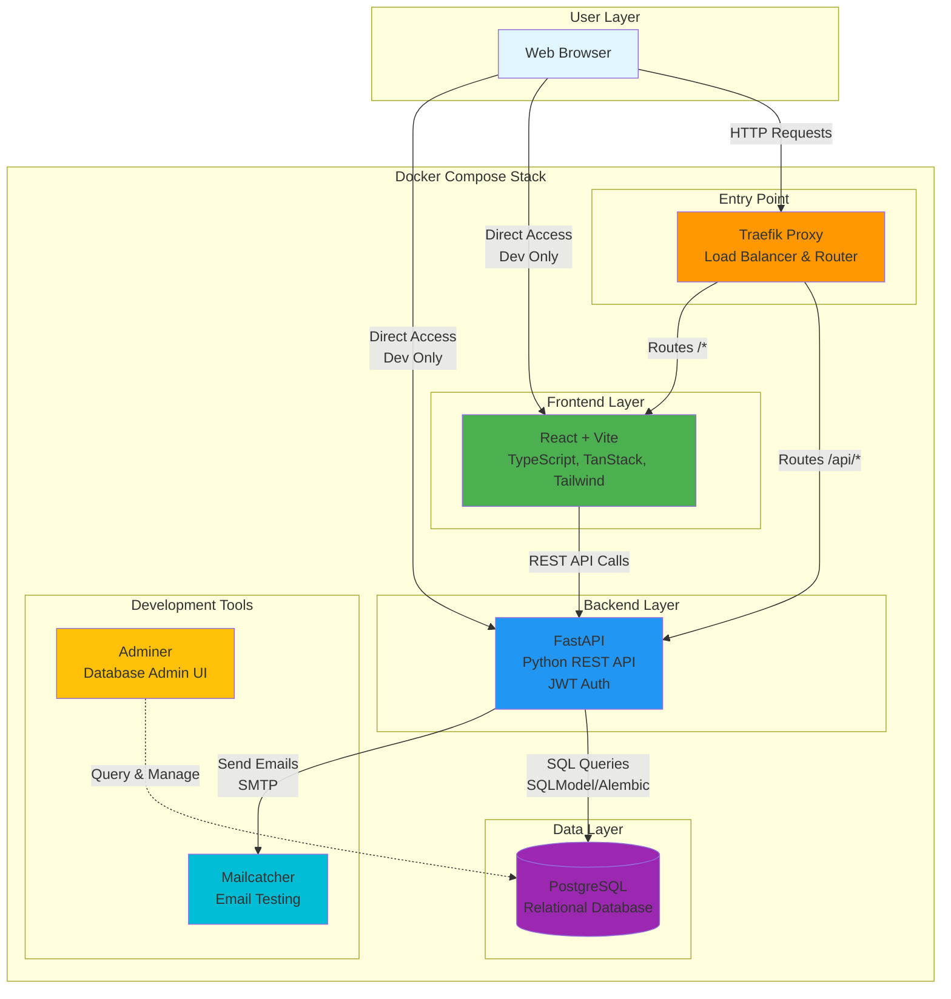
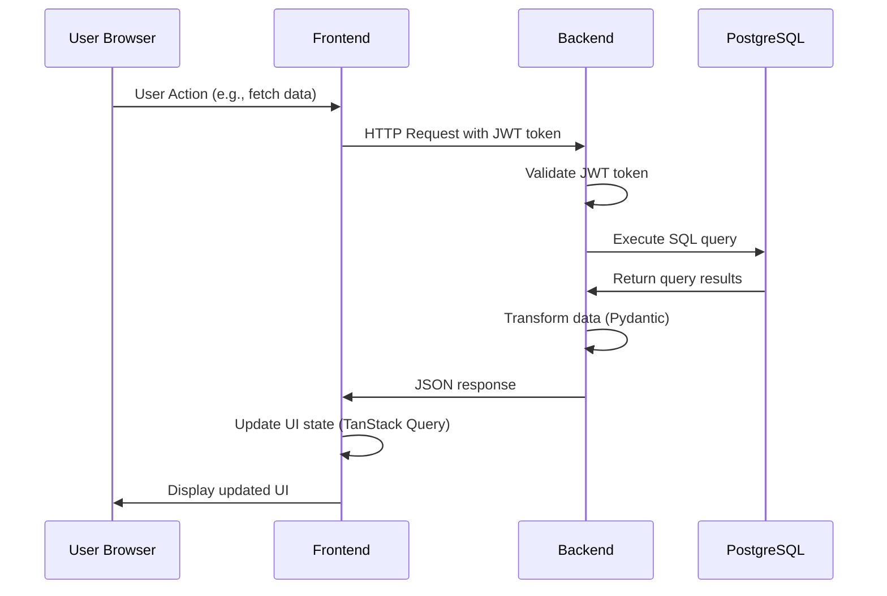
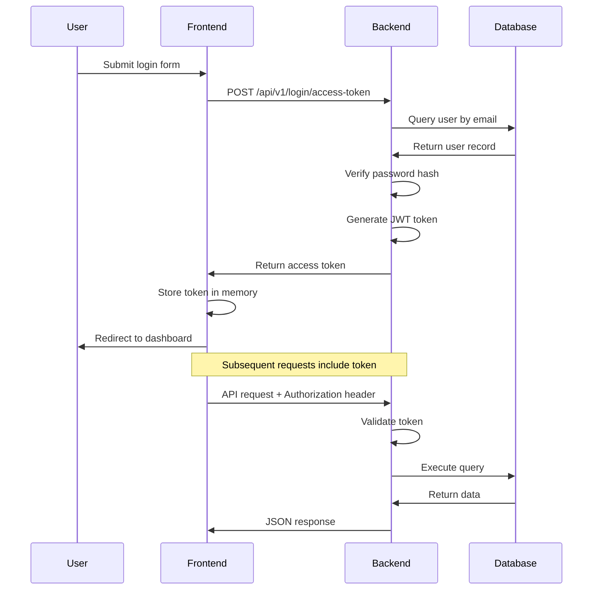

# System Architecture

This document provides a comprehensive overview of the full-stack application architecture.

## Table of Contents
- [System Overview](#system-overview)
- [Component Details](#component-details)
- [Data Flow](#data-flow)
- [Development vs Production](#development-vs-production)
- [Network Architecture](#network-architecture)

## System Overview

### Architecture Diagram



## Component Details

### 1. Traefik Proxy

**Purpose**: Reverse proxy and load balancer

**Ports**:
- 80: HTTP traffic
- 8090: Dashboard (development only)

**Responsibilities**:
- Routes traffic to appropriate services based on domain/path
- In production: Handles HTTPS/TLS certificates via Let's Encrypt
- Load balancing across multiple instances

**Routing Rules**:
- `api.*` → Backend API
- `dashboard.*` → Frontend
- `adminer.*` → Database admin (production)

**Access**: http://localhost:8090 (development)

---

### 2. Frontend - React/Vite

**Purpose**: User interface and client-side application

**Port**: 5173 (development)

**Tech Stack**:
- **React 18**: UI library with hooks
- **TypeScript**: Type safety
- **Vite**: Fast build tool with hot module replacement
- **TanStack Query**: Server state management
- **TanStack Router**: Type-safe routing
- **Tailwind CSS**: Utility-first styling
- **shadcn/ui**: Pre-built accessible components

**Features**:
- JWT-based authentication
- Dark mode support
- Auto-generated type-safe API client (from OpenAPI spec)
- Responsive design
- Hot reload in development

**Access**: http://localhost:5173

---

### 3. Backend - FastAPI

**Purpose**: REST API server and business logic

**Port**: 8000

**Tech Stack**:
- **FastAPI**: Modern Python web framework
- **SQLModel**: ORM combining SQLAlchemy + Pydantic
- **Alembic**: Database migration tool
- **Pydantic**: Data validation and settings management
- **Python-Jose**: JWT token handling
- **Passlib**: Password hashing

**Features**:
- Automatic OpenAPI/Swagger documentation
- Type hints and automatic validation
- Dependency injection system
- Background tasks
- WebSocket support (available but not configured)
- Hot reload in development

**Access**:
- API: http://localhost:8000
- Interactive Docs: http://localhost:8000/docs
- Alternative Docs: http://localhost:8000/redoc

**Key Endpoints**:
- `/api/v1/login/` - Authentication
- `/api/v1/users/` - User management
- `/api/v1/items/` - Example CRUD operations
- `/api/v1/utils/` - Health checks

---

### 4. PostgreSQL

**Purpose**: Primary relational database

**Port**: 5432

**Configuration**:
- Version: 17
- Volume: `app-db-data` (persistent storage)
- Health checks enabled
- Credentials: Configured via `.env` file

**Schema Management**:
- Migrations via Alembic
- Models defined in `backend/app/models.py`
- Automatic schema generation from SQLModel

---

### 5. Adminer

**Purpose**: Database management web interface

**Port**: 8080

**What it does**:
- Visual query builder
- Table browsing and editing
- Schema visualization
- SQL query execution
- Import/export data

**Access**: http://localhost:8080

**Login Details**:
- System: PostgreSQL
- Server: `db` (Docker internal hostname)
- Username: postgres
- Password: From `POSTGRES_PASSWORD` in `.env`
- Database: app

---

### 6. Mailcatcher

**Purpose**: Email testing tool for development

**Ports**:
- 1025: SMTP server (for sending)
- 1080: Web UI (for viewing)

**What it does**:
- Catches all outbound emails during development
- Prevents accidental email sending
- Provides web interface to view caught emails

**Use Cases**:
- Testing password reset emails
- User registration confirmations
- Notification emails
- Email template development

**Access**: http://localhost:1080

**Note**: In production, replace with real SMTP service (Mailgun, SendGrid, AWS SES, etc.)

---

## Data Flow

### Example: API Request Flow



### Authentication Flow



---

## Development vs Production

### Development Environment (Current)

**Characteristics**:
- All services on `localhost` with different ports
- Direct port access for debugging
- Hot reload enabled (code changes auto-refresh)
- Mailcatcher instead of real SMTP
- Traefik dashboard exposed
- Debug logging enabled
- CORS configured for `localhost`

**URLs**:
- Frontend: http://localhost:5173
- Backend: http://localhost:8000
- Adminer: http://localhost:8080
- Traefik: http://localhost:8090
- Mailcatcher: http://localhost:1080

**Docker Compose Files**:
- `docker-compose.yml` - Base configuration
- `docker-compose.override.yml` - Development overrides (hot reload, volume mounts)

---

### Production Environment

**Characteristics**:
- Single domain with subdomains
- HTTPS with automatic SSL certificates (Let's Encrypt)
- No direct port exposure (only 80/443)
- Real SMTP service configured
- Production-grade logging
- Optimized builds (no hot reload)
- Secrets managed via environment variables
- Database backups configured

**URLs** (example with `yourdomain.com`):
- Frontend: https://dashboard.yourdomain.com
- Backend: https://api.yourdomain.com
- Traefik: https://traefik.yourdomain.com (protected)
- Adminer: https://adminer.yourdomain.com (protected, optional)

**Docker Compose Files**:
- `docker-compose.yml` - Base configuration
- `docker-compose.traefik.yml` - Production Traefik (separate)

**Key Differences**:
- Build optimizations enabled
- Static file serving from Nginx (frontend)
- Multiple backend replicas for load balancing
- Production-grade secret management
- Automated backups
- Monitoring and alerting
- CDN integration (optional)

---

## Network Architecture

### Docker Networks

```mermaid
graph LR
    subgraph default[Default Network<br/>Internal Communication]
        FE[Frontend]
        BE[Backend]
        DB[(Database)]
        MC[Mailcatcher]
        ADM[Adminer]
    end

    subgraph traefik[Traefik-Public Network<br/>External Access]
        TR[Traefik Proxy]
    end

    TR -.->|Routes traffic| FE
    TR -.->|Routes traffic| BE

    style default fill:#e3f2fd
    style traefik fill:#fff3e0
```

**Two Docker Networks**:

1. **default**:
   - Internal service-to-service communication
   - Database, backend, and support services
   - Not exposed to external traffic

2. **traefik-public**:
   - Bridge between external traffic and internal services
   - Only Traefik and exposed services (frontend, backend)
   - Enables zero-downtime deployments

---

## File Structure

```
project-root/
├── .env                          # Environment variables (gitignored)
├── .env.example                  # Environment template
├── docker-compose.yml            # Base service definitions
├── docker-compose.override.yml   # Development overrides
├── docker-compose.traefik.yml    # Production Traefik config
│
├── backend/
│   ├── app/
│   │   ├── main.py              # FastAPI application entry
│   │   ├── api/
│   │   │   ├── main.py          # API router setup
│   │   │   ├── deps.py          # Dependency injection
│   │   │   └── routes/          # API endpoints
│   │   ├── core/
│   │   │   ├── config.py        # Settings management
│   │   │   ├── db.py            # Database connection
│   │   │   └── security.py      # Auth utilities
│   │   ├── models.py            # SQLModel database models
│   │   ├── crud.py              # Database operations
│   │   └── utils.py             # Helper functions
│   ├── tests/                   # Pytest test suite
│   ├── alembic/                 # Database migrations
│   ├── scripts/                 # Utility scripts
│   ├── pyproject.toml           # Python dependencies (uv)
│   ├── uv.lock                  # Locked dependencies
│   └── Dockerfile               # Backend container
│
└── frontend/
    ├── src/
    │   ├── main.tsx             # React app entry
    │   ├── routes/              # TanStack Router pages
    │   ├── components/          # Reusable React components
    │   ├── client/              # Auto-generated API client
    │   ├── hooks/               # Custom React hooks
    │   └── assets/              # Static assets
    ├── tests/                   # Playwright E2E tests
    ├── package.json             # Node.js dependencies
    ├── playwright.config.ts     # Test configuration
    ├── nginx.conf               # Production Nginx config
    └── Dockerfile               # Frontend container (multi-stage)
```

---

## Technology Decisions

### Why This Stack?

**FastAPI (Backend)**:
- Automatic API documentation
- Type safety with Python type hints
- High performance (async support)
- Easy to learn, hard to misuse

**React + TypeScript (Frontend)**:
- Component-based architecture
- Strong typing prevents runtime errors
- Large ecosystem and community
- Industry standard

**PostgreSQL (Database)**:
- Robust and reliable
- Excellent performance
- Rich feature set (JSON, full-text search, etc.)
- Open source with strong community

**Docker Compose (Orchestration)**:
- Consistent dev and prod environments
- Easy service management
- Version controlled infrastructure
- Simple to onboard new developers

**Traefik (Proxy)**:
- Automatic SSL certificate management
- Dynamic configuration
- Built-in load balancing
- Excellent Docker integration

---

## Scalability Considerations

### Horizontal Scaling

**Backend**:
- Stateless design (JWT tokens, no sessions)
- Can run multiple replicas behind load balancer
- Database connection pooling

**Frontend**:
- Static assets can be served from CDN
- Multiple Nginx instances

**Database**:
- Read replicas for scaling reads
- Connection pooling
- Consider managed services (AWS RDS, Google Cloud SQL)

### Vertical Scaling

- Increase container resources (CPU, memory)
- Optimize database queries and indexes
- Enable caching layer (Redis, if needed)

---

## Security Features

- **Authentication**: JWT tokens with expiration
- **Password Storage**: Bcrypt hashing
- **HTTPS**: Automatic SSL certificates in production
- **CORS**: Configurable allowed origins
- **SQL Injection**: Protected by SQLModel/SQLAlchemy
- **XSS**: React's built-in protection
- **Rate Limiting**: Can be configured in Traefik
- **Security Headers**: Configured in Nginx/Traefik

---

## Monitoring and Observability

**Development**:
- FastAPI automatic docs show request/response
- Browser DevTools for frontend debugging
- Docker logs: `docker compose logs -f`
- Traefik dashboard: http://localhost:8090

**Production** (to be configured):
- Application logs (structured JSON)
- Database slow query logs
- Traefik access logs
- Consider: Sentry (errors), Grafana (metrics), ELK stack (logs)

---

## Further Reading

- [Development Guide](./development.md)
- [Deployment Guide](./deployment.md)
- [Backend Documentation](./backend/README.md)
- [Frontend Documentation](./frontend/README.md)
- [FastAPI Documentation](https://fastapi.tiangolo.com)
- [React Documentation](https://react.dev)
- [Traefik Documentation](https://doc.traefik.io/traefik/)
