# System Diagrams

Additional technical diagrams for the Full Stack FastAPI project.

## Table of Contents
- [CI/CD Pipeline](#cicd-pipeline)
- [Database Schema](#database-schema)
- [Authentication Flow](#authentication-flow)
- [Request Lifecycle](#request-lifecycle)
- [Deployment Architecture](#deployment-architecture)

---

## CI/CD Pipeline

### GitHub Actions Workflow

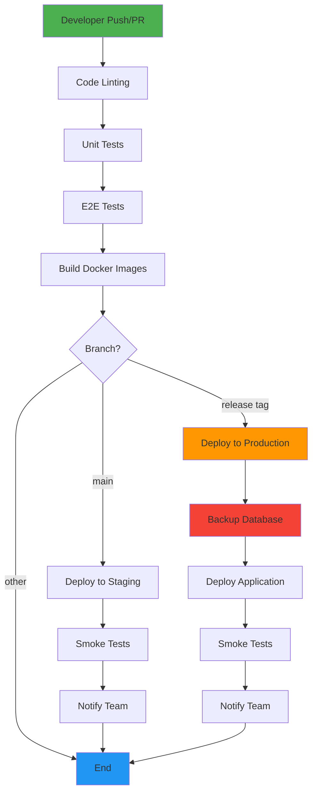

### Deployment Steps Detail

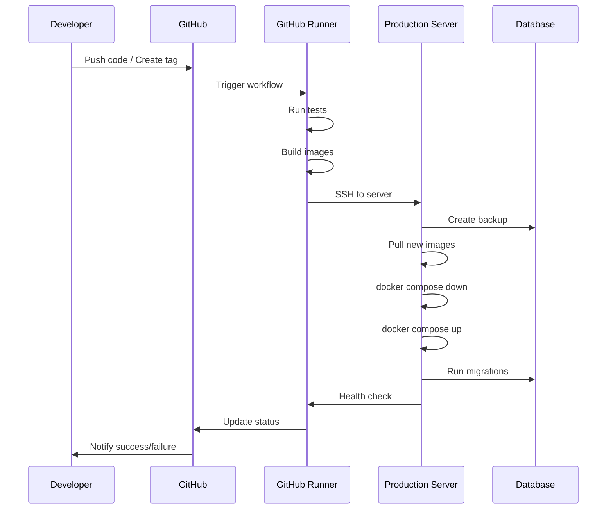

---

## Database Schema

### Entity Relationship Diagram

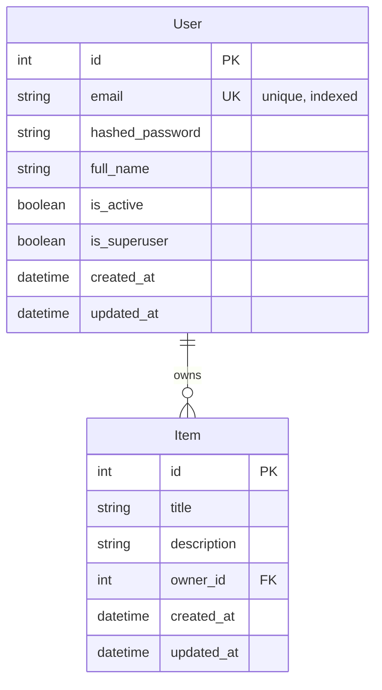

### Schema with Indexes

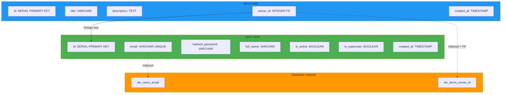

---

## Authentication Flow

### Complete Authentication Sequence

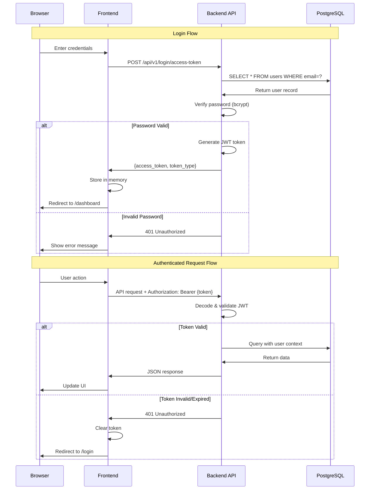

### JWT Token Structure

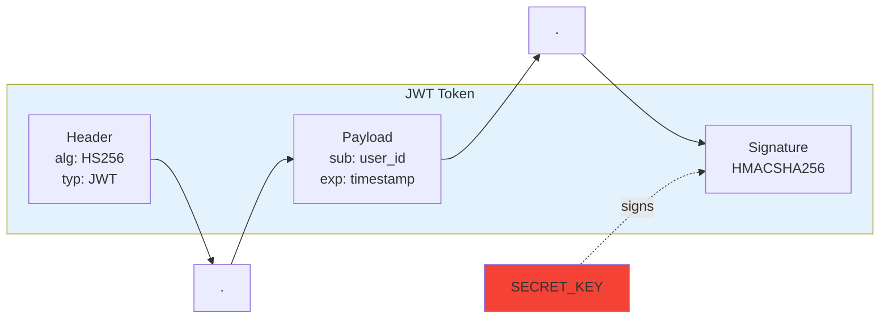

### Password Reset Flow

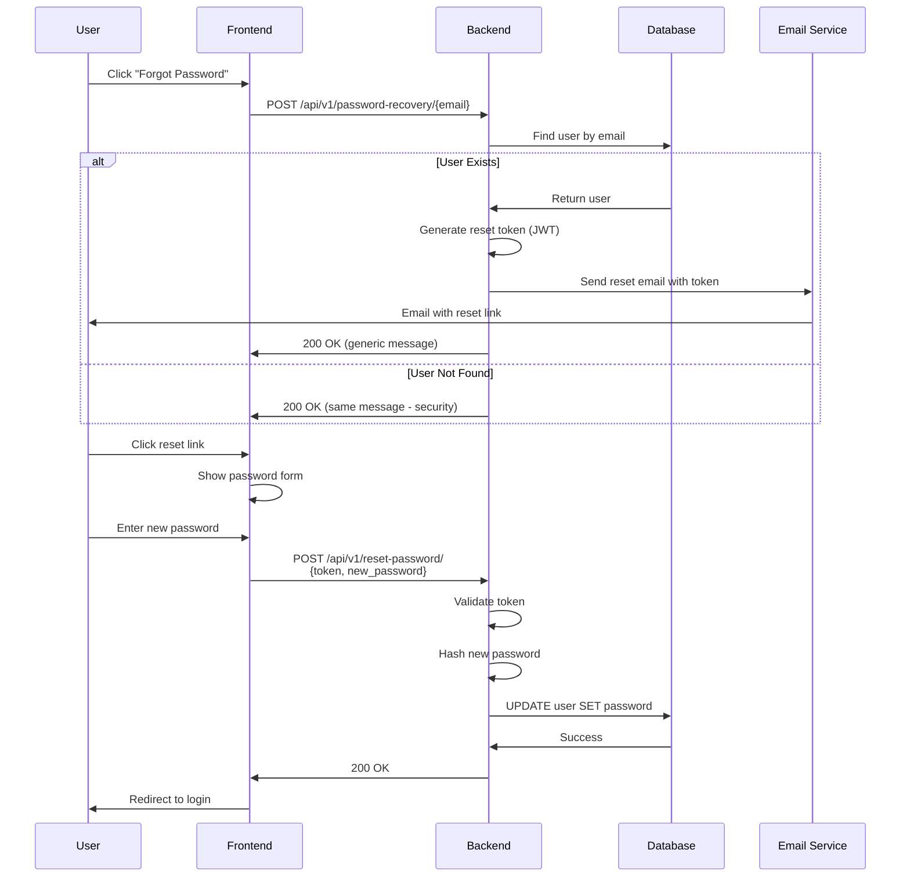

---

## Request Lifecycle

### HTTP Request Journey

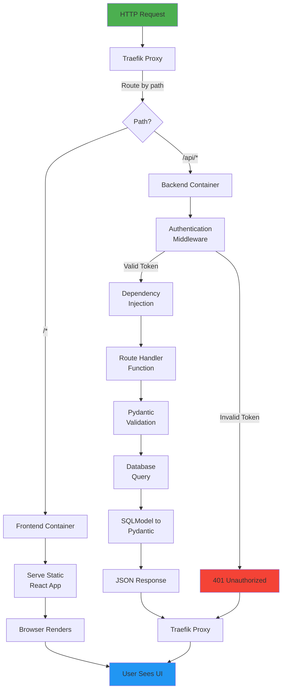

### Backend Request Processing

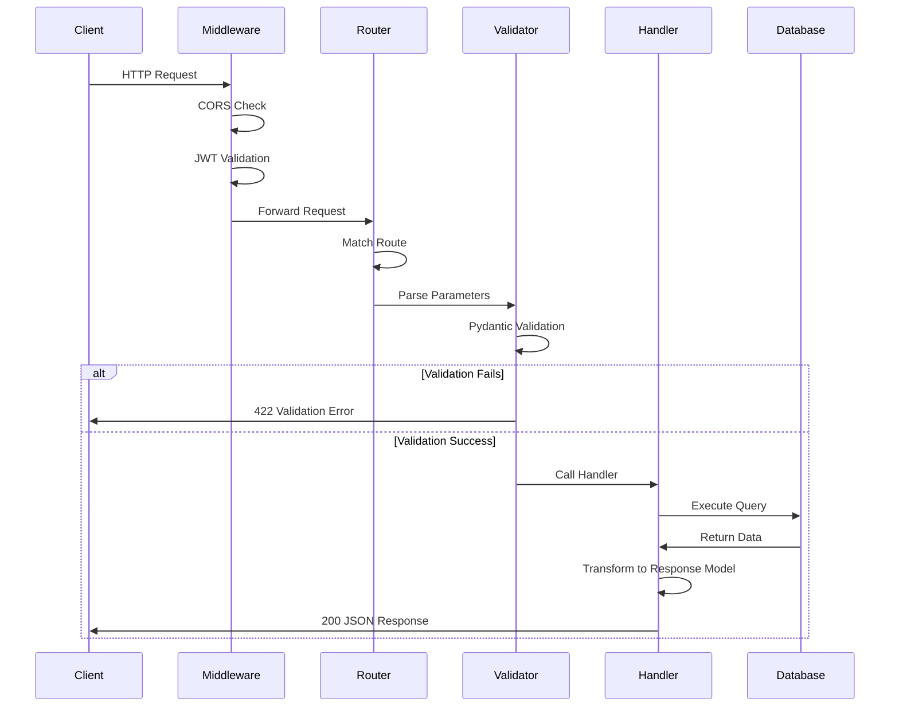

---

## Deployment Architecture

### Production Infrastructure

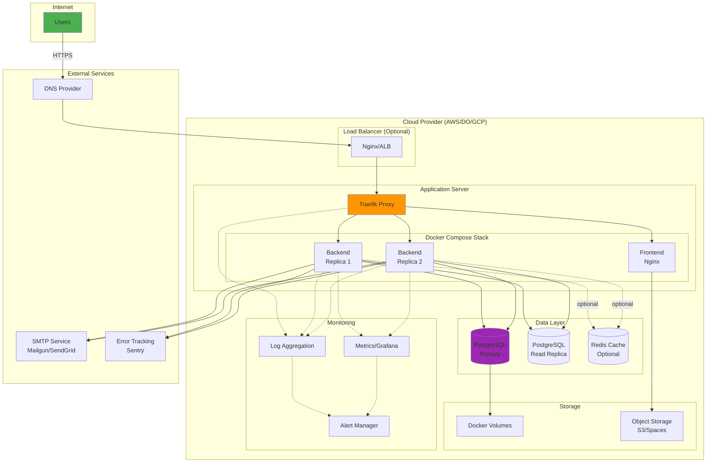

### Scaling Strategy

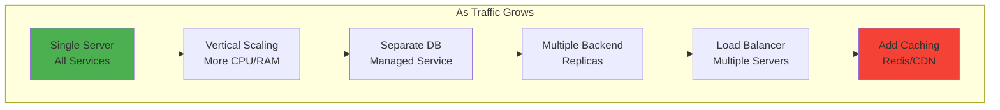

---

## Development Workflow

### Feature Development Lifecycle

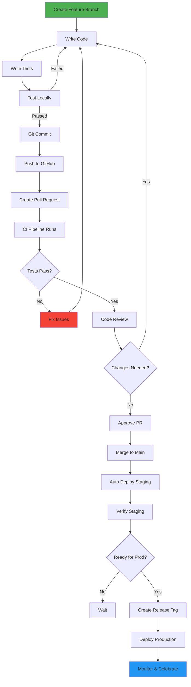

---

## Docker Compose Architecture

### Service Dependencies

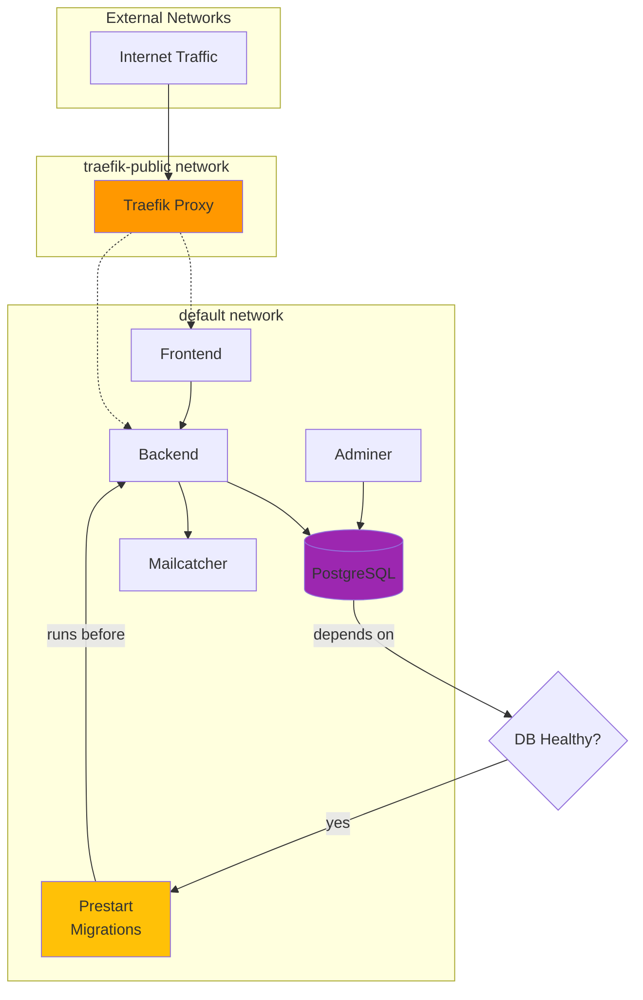

---

## Use These Diagrams

### In Presentations
Copy any Mermaid code block directly into:
- Markdown slides (Marp, reveal.js)
- Mermaid Live Editor: https://mermaid.live
- Documentation tools (GitBook, Docusaurus)

### For Documentation
- Link to this file from your docs
- Embed in README or wiki
- Include in technical proposals

### For Learning
- Walk through authentication flow with students
- Explain deployment architecture
- Show CI/CD pipeline process

---

**Tip**: These diagrams are maintained as code, making them easy to update and version control! 🎨
